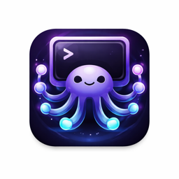

# Orca

A terminal workspace manager built on [Ghostty](https://ghostty.org). Organize terminal instances into a tree with folders, switch between them instantly, and navigate everything from the keyboard.



## What it does

Flat terminal tabs don't match how work is organized. Orca adds a sidebar tree where you can group terminals into nested folders — one folder for your API server, another for code reviews, another for Claude Code sessions. Each terminal auto-labels itself based on the running process.

## Getting started

### Prerequisites

- macOS 14.0+
- Xcode 16+
- [Zig](https://ziglang.org/download/) (for building GhosttyKit)

### Build GhosttyKit

```bash
git clone --recursive https://github.com/rbangre-halliday/orca.git
cd orca
./Scripts/build-ghostty.sh
```

This builds the GhosttyKit.xcframework from the Ghostty submodule and places it in `Frameworks/`.

### Build Orca

```bash
xcodebuild -scheme Orca -configuration Debug build
```

Or open `Orca.xcodeproj` in Xcode and hit Cmd+R.

### Run

```bash
# Run from a specific directory (the folder name becomes your root workspace)
cd ~/projects/myapp
/path/to/DerivedData/Orca-*/Build/Products/Debug/Orca.app/Contents/MacOS/Orca
```

Tip: add an alias to your `.zshrc`:

```bash
alias orca='/path/to/DerivedData/Orca-*/Build/Products/Debug/Orca.app/Contents/MacOS/Orca'
```

Then just `cd ~/projects/myapp && orca`.

## Keyboard shortcuts

### Global

| Shortcut | Action |
|---|---|
| `Cmd+T` | New terminal (in focused folder context) |
| `Cmd+W` | Close current terminal |
| `Cmd+Shift+N` | New folder |
| `Cmd+Shift+]` | Next terminal |
| `Cmd+Shift+[` | Previous terminal |
| `Cmd+E` | Toggle sidebar |
| `Cmd+1` | Focus sidebar |
| `Cmd+2` | Focus terminal |

### Sidebar (when focused)

| Key | Action |
|---|---|
| `j` / `k` | Move down / up |
| `h` / `l` | Collapse / expand folder |
| `Enter` | Activate terminal (switches to it and focuses terminal) or toggle folder |
| `r` | Rename selected item |
| `Backspace` | Delete selected item |
| `Tab` / `Escape` | Return focus to terminal |
| Arrow keys | Standard navigation (also works) |

### Context menus

Right-click any item in the sidebar for options: Add Terminal, Add Subfolder, Rename, Delete.

## Features

- **Nestable folders** — unlimited depth, organize however you want
- **Auto-labeling** — terminals show the running process name (vim, npm, claude, etc.)
- **Drag and drop** — reorder terminals and folders, move items between folders
- **Vim-style navigation** — hjkl in the sidebar, full keyboard-driven workflow
- **Context-aware creation** — Cmd+T creates inside the currently focused folder
- **Ghostty-powered** — full terminal emulation via libghostty (Metal rendering, GPU-accelerated)

## Architecture

```
Orca/
├── App/
│   ├── OrcaApp.swift          # Entry point, ghostty_init()
│   └── AppDelegate.swift      # Window, split view, menu, wiring
├── Features/
│   ├── Terminal/
│   │   ├── GhosttyApp.swift   # ghostty_app_t lifecycle + callbacks
│   │   ├── TerminalView.swift # NSView hosting ghostty_surface_t
│   │   └── TerminalManager.swift # Multi-terminal create/switch/close
│   └── Sidebar/
│       └── OutlineSidebarView.swift # NSOutlineView tree + keyboard + drag-drop
├── Models/
│   ├── WorkspaceNode.swift    # Recursive tree data model (Codable)
│   └── WorkspaceStore.swift   # Tree mutations + JSON persistence
└── Resources/
    └── Assets.xcassets/       # App icon
```

## License

MIT
